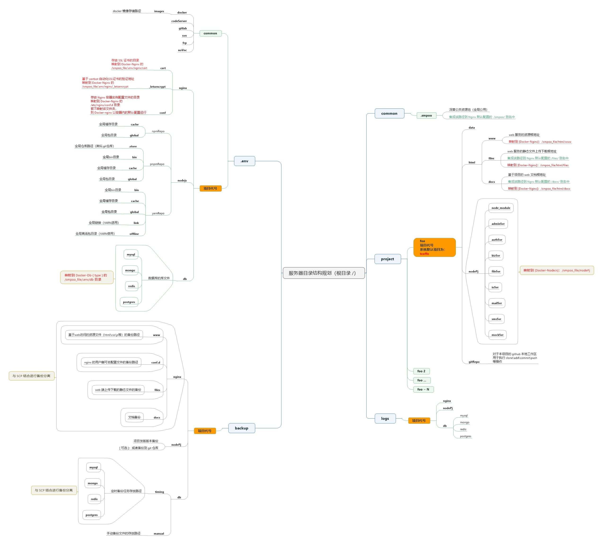

<link rel="stylesheet" type="text/css" href=".resource/css/style.css">
# install-linux
tFrame工程脚本集合

## 用例

### 初始化 Linux 服务器
> #### 推荐：(避免防火墙干扰，下载即安装)
```shell
sh -c "$(wget https://cdn.jsdelivr.net/gh/fanzouguo/install-linux@16.2.0/script/install.sh -O -)"
```
> #### 或：
```shell
curl -o- https://cdn.jsdelivr.net/gh/fanzouguo/install-linux@16.1.0/script/install.sh | bash
```

> #### 也可以在初始化时，传入项目名称，项目名称缺省为：tcoffe
```shell
wget https://cdn.jsdelivr.net/gh/fanzouguo/install-linux@16.1.0/script/install.sh | sh [项目名称]
```

## 工作空间结构

### smpoo_file 工作空间基底目录

### smpoo_file 工作空间基底目录


> #### common 深普公共资源池（全局公用）
<table class="tableWrapper">
	<thead>
		<tr>
			<th colspan="2" class="textCenter">文件夹名称</th>
			<th class="textCenter">说明</th>
			<th class="textCenter">备注</th>
		</tr>
	</thead>
	<tbody>
        <!-- nginx -->
		<tr>
			<td>common</td>
			<td>.smpoo</td>
			<td>深普公共资源池（全局公用）</td>
			<td>集成该路径到 Nginx 默认配置的  /smpoo/ 别名中</td>
		</tr>
	</tbody>
</table>


> #### .env 环境文件夹
<table class="tableWrapper">
	<thead>
		<tr>
			<th colspan="4" class="textCenter">文件夹名称</th>
			<th class="textCenter">说明</th>
			<th class="textCenter">对应容器内路径</th>
		</tr>
	</thead>
	<tbody>
        <!-- nginx -->
		<tr>
			<td rowspan="18">.env</td>
			<td rowspan="3">nginx</td>
			<td colspan="2">cert</td>
			<td>存放 SSL 证书的目录</td>
			<td>[Docker-Nginx]:/smpoo_file/.env/nginx/cert</td>
		</tr>
		<tr>
			<td colspan="2">_letsencrypt</td>
			<td>基于 certbot 自动化SSL证书的验证地址</td>
			<td>[Docker-Nginx]:/smpoo_file/.env/nginx/_letsencrypt</td>
		</tr>
		<tr>
			<td><span class="projectCode">项目代号</span></td>
			<td>conf</td>
			<td>存放 Nginx 容器实例配置文件的目录，若不映射该文件夹，则 Docker-nginx 以容器内的默认配置运行</td>
			<td>[Docker-Nginx]:/etc/nginx/conf.d</td>
		</tr>
        <!-- db -->
		<tr>
			<td rowspan="4">db</td>
			<td colspan="2">mysql</td>
			<td rowspan="4">数据库实例文件存储路径</td>
			<td rowspan="4">[Docker-db-mysql]:/smpoo_file/.env/db</td>
		</tr>
		<tr>
			<td colspan="2">mongo</td>
		</tr>
		<tr>
			<td colspan="2">redis</td>
		</tr>
		<tr>
			<td colspan="2">postgres</td>
		</tr>
        <!-- docker -->
		<tr>
			<td>docker</td>
			<td colspan="2">images</td>
			<td>docker 镜像存储路径</td>
			<td></td>
		</tr>
        <!-- nodejs -->
		<tr>
			<td rowspan="5">nodejs</td>
			<td colspan="2">bin</td>
			<td>全局bin目录-（pnpm适用）</td>
			<td></td>
		</tr>
		<tr>
			<td colspan="2">cache</td>
			<td>全局缓存目录</td>
			<td></td>
		</tr>
		<tr>
			<td colspan="2">global</td>
			<td>全局包目录</td>
			<td></td>
		</tr>
		<tr>
			<td colspan="2">link</td>
			<td>全局链接（YARN适用）</td>
			<td></td>
		</tr>
		<tr>
			<td colspan="2">offline</td>
			<td>全局离线包目录（YARN使用）</td>
			<td></td>
		</tr>
        <!-- codeServer -->
		<tr>
			<td>codeServer</td>
			<td colspan="2"></td>
			<td>code-server 服务环境路径</td>
			<td>[Docker-codeServer]:/待补充</td>
		</tr>
        <!-- gitLab -->
		<tr>
			<td>gitLab</td>
			<td colspan="2"></td>
			<td>gitLab 服务环境路径</td>
			<td>[Docker-gitLab]:/待补充</td>
		</tr>
        <!-- svn -->
		<tr>
			<td>svn</td>
			<td colspan="2"></td>
			<td>svn 服务环境路径</td>
			<td>[Docker-svn]:/待补充</td>
		</tr>
        <!-- frp -->
		<tr>
			<td>frp</td>
			<td colspan="2"></td>
			<td>frp 远程穿透服务环境路径</td>
			<td>[Docker-frp]:/待补充</td>
		</tr>
        <!-- noVnc -->
		<tr>
			<td>noVnc</td>
			<td colspan="2"></td>
			<td>noVnc 服务环境路径</td>
			<td>[Docker-frp]:/待补充</td>
		</tr>
	</tbody>
</table>


> #### foo（此处以 foo 代表项目代号，系统默认代码为tcoffe） 项目文件夹
<table class="tableWrapper">
	<thead>
		<tr>
			<th colspan="3" class="textCenter">文件夹名称</th>
			<th class="textCenter">说明</th>
			<th class="textCenter">对应容器内路径</th>
		</tr>
	</thead>
	<tbody>
		<tr>
			<td rowspan="14"><span class="projectCode">项目代号</span></td>
			<td>data</td>
			<td>系统默认项目代号为：tcoffe</td>
			<td></td>
		</tr>
		<tr>
			<td rowspan="3">html</td>
			<td>www</td>
			<td>web 服务的资源根地址</td>
			<td>[Docker-db-nginx]:/smpoo_file/html/www</td>
		</tr>
		<tr>
			<td>files</td>
			<td>web 服务的静态文件上传下载根地址</td>
			<td>[Docker-db-mongo]:/smpoo_file/html/files</td>
		</tr>
		<tr>
			<td>docs</td>
			<td>基于项目的 web 文档根地址</td>
			<td>[Docker-db-redis]:/smpoo_file/html/docs</td>
		</tr>
		<tr>
			<td rowspan="9">svrApp</td>
			<td>node_module</td>
			<td>服务端主程序依赖的 NodeJs 包路径</td>
			<td></td>
		</tr>
		<tr>
			<td>adminSvr</td>
			<td>管理员入口服务</td>
			<td></td>
		</tr>
		<tr>
			<td>authSvr</td>
			<td>鉴权服务</td>
			<td></td>
		</tr>
		<tr>
			<td>bizSvr</td>
			<td>主业务服务</td>
			<td></td>
		</tr>
		<tr>
			<td>fileSvr</td>
			<td>文件服务</td>
			<td></td>
		</tr>
		<tr>
			<td>ioSvr</td>
			<td>接口服务</td>
			<td></td>
		</tr>
		<tr>
			<td>mailSvr</td>
			<td>邮件服务</td>
			<td></td>
		</tr>
		<tr>
			<td>smsSvr</td>
			<td>短信服务</td>
			<td></td>
		</tr>
		<tr>
			<td>mockSvr</td>
			<td>模拟服务</td>
			<td></td>
		</tr>
		<tr>
			<td colspan="2">gitRepo</td>
			<td>本项目的 github 操作空间</td>
			<td></td>
		</tr>
	</tbody>
</table>


> #### backup 备份缓存文件夹
<table class="tableWrapper">
	<thead>
		<tr>
			<th colspan="5" class="textCenter">文件夹名称</th>
			<th class="textCenter">说明</th>
		</tr>
	</thead>
	<tbody>
		<tr>
			<td rowspan="10">backup</td>
			<td rowspan="9"><span class="projectCode">项目代号</span></td>
			<td rowspan="4">nginx</td>
			<td colspan="2">www</td>
			<td>基于web访问的资源文件（html\css\js等）的备份路径</td>
		</tr>
		<tr>
			<td colspan="2">conf.d</td>
			<td>nginx 的用户侧可变配置文件的备份路径</td>
		</tr>
		<tr>
			<td colspan="2">files</td>
			<td>web 端上传下载的静态文件的备份</td>
		</tr>
		<tr>
			<td colspan="2">docs</td>
			<td>文档备份</td>
		</tr>
		<tr>
			<td rowspan="5">db</td>
			<td rowspan="4">timing</td>
			<td>mysql</td>
			<td rowspan="4">定时备份任务存放路径</td>
		</tr>
		<tr>
			<td>mongo</td>
		</tr>
		<tr>
			<td>redis</td>
		</tr>
		<tr>
			<td>postgres</td>
		</tr>
		<tr>
			<td colspan="2">manual</td>
            <td>手动备份文件的存放路径</td>
		</tr>
		<tr>
			<td colspan="4"><span class="projectCode">some other project code</span></td>
            <td>其他项目代号，用于实现按照项目代号的备份隔离</td>
		</tr>
	</tbody>
</table>


> #### logs 日志文件夹
<table class="tableWrapper">
	<thead>
		<tr>
			<th colspan="5" class="textCenter">文件夹名称</th>
			<th class="textCenter">说明</th>
		</tr>
	</thead>
	<tbody>
		<tr>
			<td rowspan="13">logs</td>
			<td colspan="2">nginx</td>
			<td>nginx日志文件存储路径</td>
			<td>[Docker-Nginx]:/smpoo_file/logs/nginx</td>
		</tr>
		<tr>
			<td rowspan="4">db</td>
			<td>mysql</td>
			<td>mysql 类型数据库的日志文件存储路径</td>
			<td>[Docker-db-mysql]:/待补充</td>
		</tr>
		<tr>
			<td>mongo</td>
			<td>mongo 类型数据库的日志文件存储路径</td>
			<td>[Docker-db-mongo]:/待补充</td>
		</tr>
		<tr>
			<td>redis</td>
			<td>redis 类型数据库的日志文件存储路径</td>
			<td>[Docker-db-redis]:/待补充</td>
		</tr>
		<tr>
			<td>postgres</td>
			<td>postgres 类型数据库的日志文件存储路径</td>
			<td>[Docker-db-postgres]:/待补充</td>
		</tr>
		<tr>
			<td rowspan="8"><span class="projectCode">项目代号</span></td>
			<td>adminSvr</td>
			<td>web端管理入口服务日志</td>
			<td></td>
		</tr>
		<tr>
			<td>authSvr</td>
			<td>鉴权服务日志</td>
			<td></td>
		</tr>
		<tr>
			<td>bizSvr</td>
			<td>主业务服务日志</td>
			<td></td>
		</tr>
		<tr>
			<td>fileSvr</td>
			<td>文件服务日志</td>
			<td></td>
		</tr>
		<tr>
			<td>ioSvr</td>
			<td>接口服务日志</td>
			<td></td>
		</tr>
		<tr>
			<td>mailSvr</td>
			<td>邮件服务日志</td>
			<td></td>
		</tr>
		<tr>
			<td>smsSvr</td>
			<td>短信服务日志</td>
			<td></td>
		</tr>
		<tr>
			<td>mockSvr</td>
			<td>模拟服务日志</td>
			<td></td>
		</tr>
	</tbody>
</table>

### smpoo_disk \[可选\] 数据盘根目录
如果服务器有独立挂载的数据盘的话，在 / 下建立该目录，挂载整个数据盘

## 注意

为避免网络原因导致 raw.githubusercontent 访问失败，可以事先添加以下 host 解析记录
``` shell
echo "185.199.108.133 raw.githubusercontent.com" >> /etc/hosts
echo "185.199.109.133 raw.githubusercontent.com" >> /etc/hosts
echo "185.199.110.133 raw.githubusercontent.com" >> /etc/hosts
echo "185.199.111.133 raw.githubusercontent.com" >> /etc/hosts
```

> !以上 ip 地址解析于 https://githubusercontent.com.ipaddress.com/raw.githubusercontent.com ,请注意 IP 地址变动
